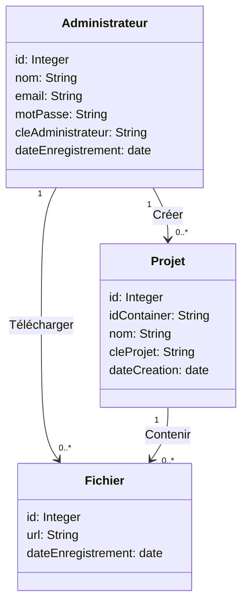

# 🚀 Dock Lift CLI

📦 Outil CLI de backup S3 ☁️ en Go 🐹, pour sauvegarder facilement les fichiers statiques de conteneurs Docker 🐳.

---

## ✨ Description

**Dock Lift CLI** est un outil en ligne de commande permettant de :

- 📂 Sauvegarder des fichiers depuis des conteneurs Docker
- ☁️ Les envoyer vers un stockage S3
- ⚡ Automatiser les backups rapidement

👉 Objectif : simplifier la gestion et la sauvegarde des fichiers Docker.

---

## 🛠️ Technologies

- 🐹 Go (Golang)
- 🐳 Docker
- ☁️ Amazon S3

---

## 📦 Installation

```bash
# Cloner le projet
git clone https://github.com/jobiyax/dock-lift-cli.git

# Aller dans le dossier
cd dock-lift-cli

# Lancer le projet
go run main.go
```

---

## 📁 Structure du projet

```
dock-lift-cli/
├── go.mod
├── main.go
└── README.md
```

---

## ▶️ Utilisation

```bash
go run main.go
```

💡 Sortie :

```
Dock Lift CLI
```

---

## 📊 Diagramme de classes



---

## ⚠️ État du projet

🚧 Projet en cours de développement
🔧 Fonctionnalités à venir :

- Authentification 🔐
- Gestion des projets 📁
- Upload vers S3 ☁️

---

## 🤝 Contribution

Les contributions sont les bienvenues 🙌

1. Fork le projet 🍴
2. Crée une branche 🔀
3. Fais tes modifications ✏️
4. Ouvre une Pull Request 🚀

---

## 📜 Licence

Ce projet est sous licence **MIT** 📄

👉 Tu es libre de :

- utiliser ✅
- modifier ✅
- distribuer ✅

---

## ❤️ Remerciements

- Go 🐹
- Docker 🐳
- AWS S3 ☁️

---

## 🚀 Conclusion

Un README clair = projet professionnel ✨
Dock Lift CLI vise à rendre le backup Docker simple et rapide ⚡
